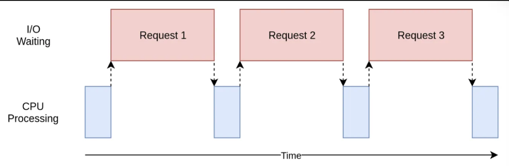
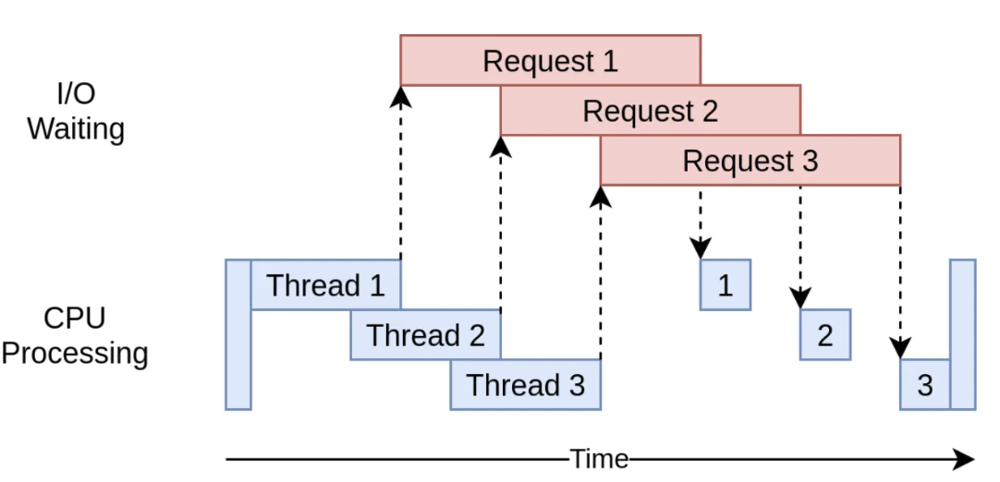
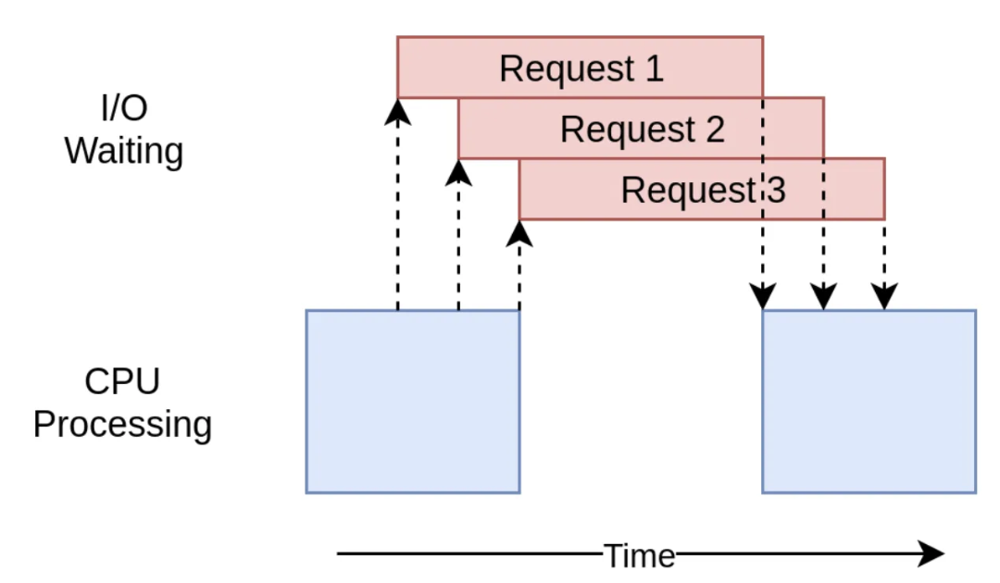
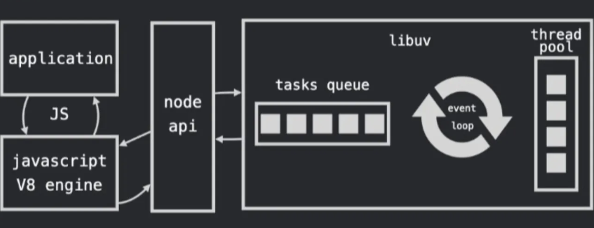

## 날짜: 2025-02-01

### 스크럼
- Git Repo를 Organization에 옮겨볼 예정
- 쓰레드의 수와 성능이 비례할까?
- TIL 레포지토리를 새로 만들어 이전 (bare-clone)

### 새로 배운 내용
#### 쓰레드가 많을 수록 반드시 성능이 향상되는가?
- 동시처리 가능한 작업수가 증가하므로 성능이 대체적으로 향상됨
- 모든 기술은 기회비용이 존재하므로 이를 파악하기 위해 지식이 필요함.
- 스레드의 구조와 동시성에 대한 지식이 필요함.
- 싱글 스레드, 멀티 스레드의 사례를 보며 반례를 찾아보려고 함.

#### 1. 임계 영역
- 멀티 스레드는 프로세스의 자원을 공유함
- 컨텍스트 스위칭도 프로세스에 비해 빠름
- But, 임계영역의 공유 자원에 스레드들이 동시 접근이 가능함
-> 데이터 일관성, 정확성을 위해 동기화 기법이 필요

| 임계 영역 (아직 명확히 모르겠음)
| - 공유 자원을 접근하는 코드 영역

##### 동기화 기법의 대표 2가지
- 뮤텍스 / 세마포어

##### 동기화 기법의 단점
- 하나 혹은 그 이상의 동기화 대상을 제외
- 나머지 스레드들의 실행 중지, 대기로 인한 병목현상 발생

##### 뮤텍스/세마포어
1. 데이터 접근 전 락을 획득
2. 데이터 접근 후 락을 해제
-> 두 절차에서 시간이 추가적으로 소요
-> 소요된 시간만큼 나머진 대기 혹은 중지하여야함

#### CPU 캐시와 메모리
- 공유 자원이 수정될때, CPU 각 코어의 캐시에 저장된 데이터들 간의 차이가 발생할 수 있음

##### 해결 방법
- CPU 캐시에서 데이터를 불러옴
-> 비용 추가 발생
-> 성능에 영향줌

#### 아하! 공유 데이터가 많을 경우엔 동기화 + 캐시 일관성 작업때문에 병목현상이 일어나는구나~~

#### 그럼 공유데이터 적고, CPU,메모리 사용량이 적으면 싱글이 낫나요?
- 요즘 CPU 싱글 코어 잘 안씀
- 요즘 프로그램들 데이터 많고 로직 복잡함
- 병목이 있어도 멀티가 더 빠른 경우가 비일비재
- 대신 멀티와 싱글의 성능 차이가 그렇게 드라마틱하진 않다.

#### 2. 컨텍스트 스위칭 오버헤드
- 멀티 태스킹 과정에서 CPU가 현재 스레드 상태를 저장
- 다른 스레드로 전환될 때 생기는 텀 (비용)
-> 스레드의 관점
- 스레드 수에 비례해서 스위칭 횟수도 증가한다
- 따라서 오버헤드도 많아지고 성능 저하의 원인이 된다.

#### 3. 스레드 풀
- 작업이 한가할 때 한 두개의 스레드만 작업하고 있을 경우
- 잔여 스레드들이 자원을 불필요하게 점유하여 성능을 저하시킨다
- 오류가 발생할 수 있음

- CPU 설계 자체가 할게 없어도 다른 스레드에게 CPU 시간을 양도하게 만들어져있다.
- 자원 낭비 + 스위칭으로 인한 오버헤드 -> 성능 저하

##### 해결방법
- 스레드 풀으로 스레드 수 관리 -> 리소스 낭비 줄일 수 있음
- 스레드 풀도 공부해야 할 것 같다.

#### 4. 어플리케이션의 특징
- 쪼갤 수 없는 어플리케이션이면 싱글로 할 수 밖에 없음
- ex) 순차적으로 동작되어야하는 어플리케이션
-> 멀티로 해봤자, 오버헤드만 추가됨
- 크게 2가지 예시가 있다. (공부해야할듯)

##### CPU 바운드
- CPU 연산 능력에 의존하는 작업
- Goetz의 자바 병렬 프로그래밍에 관한 논문을 읽어볼것
- CPU 바운드 작업에 적절한 스레드 수 == 코어 수 + 1 주장
- CPU 자체를 많이 쓰므로 스레드와 코어수가 같아봤자 의미가 없다.

##### I/O 바운드
- I/O 장치 응답 속도에 의존하는 작업
- 입출력 작업이 많으면 스레드를 늘리는 것이 좋다

- I/O 작업동안 CPU 작업이 블로킹

- I/O 작업동안 스레드에 할 일 할당함

- CPU와 다르게 I/O 작업이 많으면 코어 수보다 스레드를 몇배씩 늘려주는 것이 성능에 대체적으로 좋다.
- 오버헤드와 동기화는 신경써야한다.
##### 해결방법?
- 멀티 스레드 모델을 이벤트 기반 프로그래밍 모델로 변경(비동기 I/O 에 특화)
- ex) node.js : 싱글 스레드 + 이벤트 기반
1. 이벤트 루프로 이벤트 감지
2. 이벤트 핸들러 호출
3. 이벤트 처리
    - 입출력 작업 -> 비동기 I/O 사용
    - 입출력 작업 완료될때까지 이벤트 루프 블로킹 X
    - 이게 리소스는 더 적게 먹는다는 말

- CPU, I/O 바운드 작업이 발생하면
- node.js는 멀티 스레드를 가져와 비동기 처리함
```
싱글 스레드 + 이벤트 기반 프로그래밍 모델 + 비동기 I/O 모델
```

#### GUI
- 상호작용할 버튼 등등이 많다.
- 여러 입력장치 (키보드, 마우스)를 통해 이벤트 감지, 메시지 출력, 액션을 해야함.
- 따라서 동기화 문제가 발생해 처리 순서가 바뀌면 안됨
- 데드락 발생 가능성도 고려해야함
- 결론 : 싱글 스레드 사용이 더 안정적임
- 이벤트 기반 프로그래밍 모델로 사용하는 것도 적합

#### 정리
- 싱글 스레드는 개발이 쉽고, 자원을 적게 쓴다.
- 멀티 스레드는 개발과정이 복잡하고, 대체로 빠른 속도를 지닌다.
- 그러나 안정성, 유지보수 측면을 무시할 수 없다.

### 오늘의 회고
- 오늘은 해당 공부를 하면서 지식을 얻었다기 보다는 좋은 강의를 들은 느낌이 있었다. 내 것을 만들지는 못한 것 같지만, 내가 모르는 부분이 어디이고, 개념이 부족한 점이 어디인지, 또 이 과정을 이때까지 잘 모르고 어렴풋이만 알았다는 게 가장 큰 것 같다. 끊임없이 공부할 거리가 생기는 것 같아 좋다.

### 참고 자료 및 링크
- [TIL 레포지토리 (bare-clone)](https://soranhan.tistory.com/11)