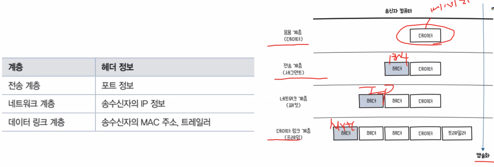

# TIL Template

## 날짜: 2025-02-03
### 스크럼
- 네트워크 수업 정리
- 웹, js 강의 수강

### 새로 배운 내용
#### 주제 1: 주제에 대한 설명
- 상세 내용 1
- 상세 내용 2
- 상세 내용 3

#### 주제 2: 주제에 대한 설명
- 상세 내용 1
- 상세 내용 2

- 서버, 네트워크, 클라이언트를 고려
- 네트워크 : 여러 통신장비들이 그물망처럼 연결되어 데이터 교환, 협력하여 일할 수 있게 하는 통신망
- 포트 번호 : 어플리케이션 구분을 위한 번호
- 헤더 : 계층을 지나면서 덧붙여지는 정보
- 캡슐화 : 헤더가 붙는 현상? 과정?
- 역캡슐화 : 헤더가 떨어져 나가는 과정

### 오늘의 도전 과제와 해결 방법
- 도전 과제 1: 도전 과제에 대한 설명 및 해결 방법
- 도전 과제 2: 도전 과제에 대한 설명 및 해결 방법

### 오늘의 회고
- 오늘의 학습 경험에 대한 자유로운 생각이나 느낀 점을 기록합니다.
- 성공적인 점, 개선해야 할 점, 새롭게 시도하고 싶은 방법 등을 포함할 수 있습니다.

### 참고 자료 및 링크
- [링크 제목](URL)
- [링크 제목](URL)
