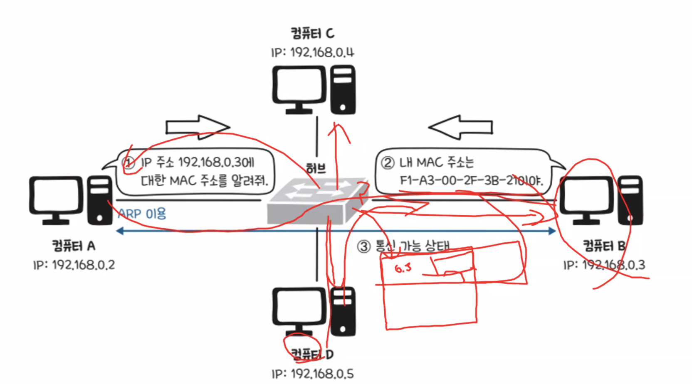
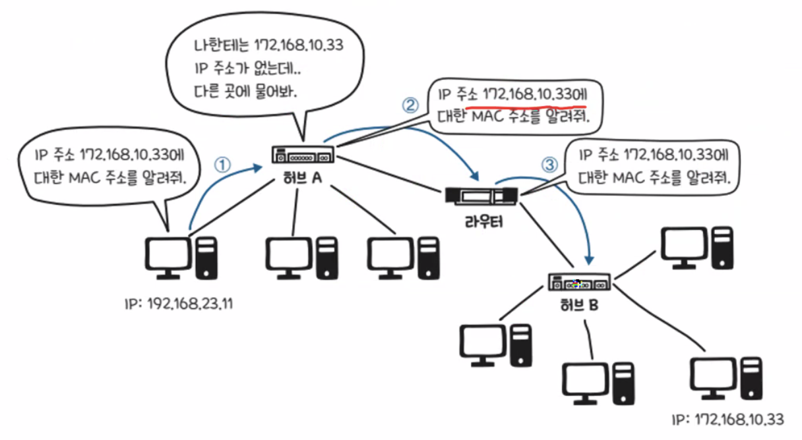
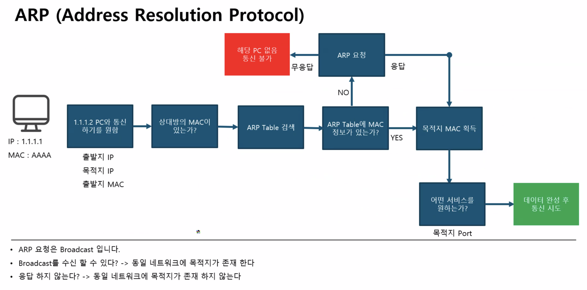
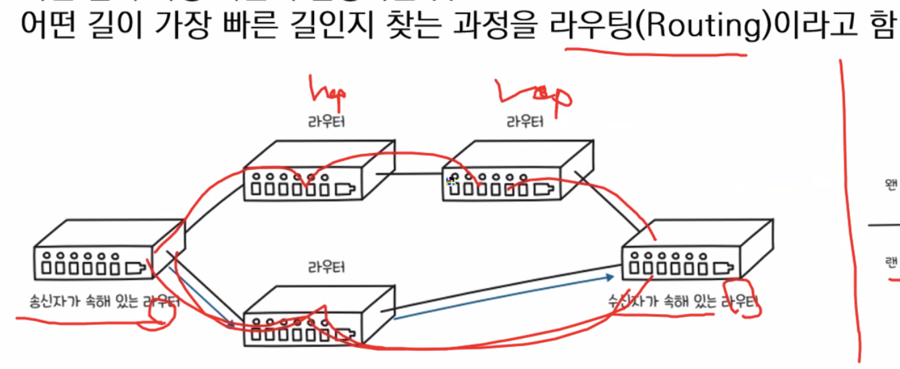
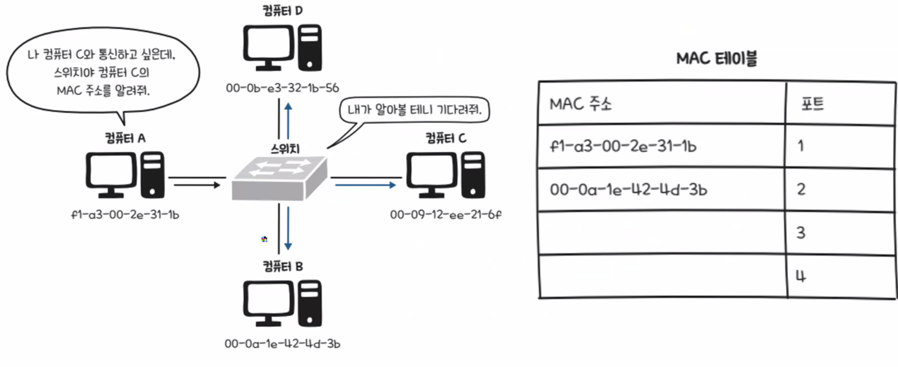
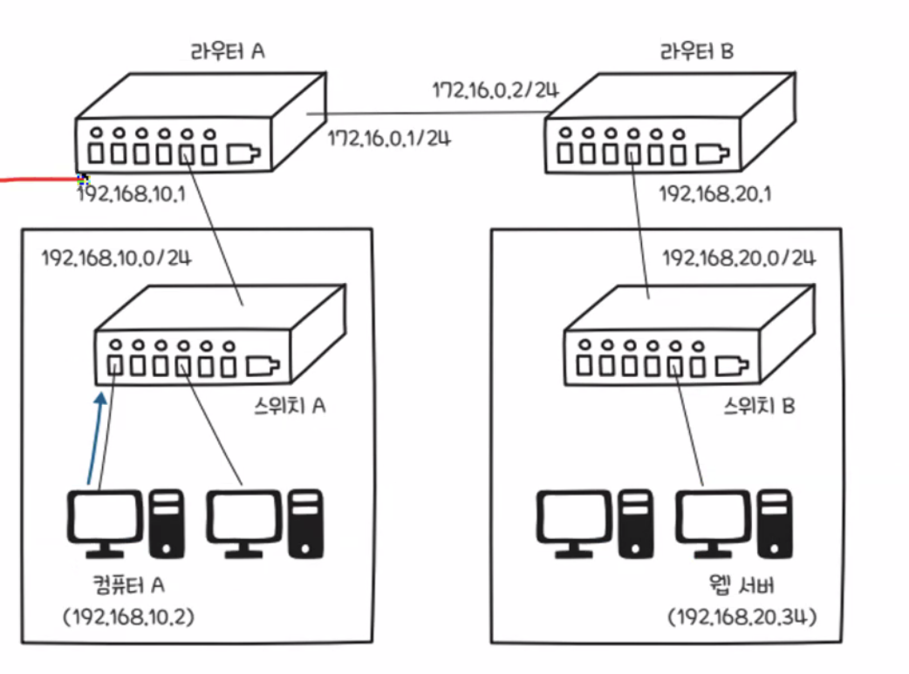
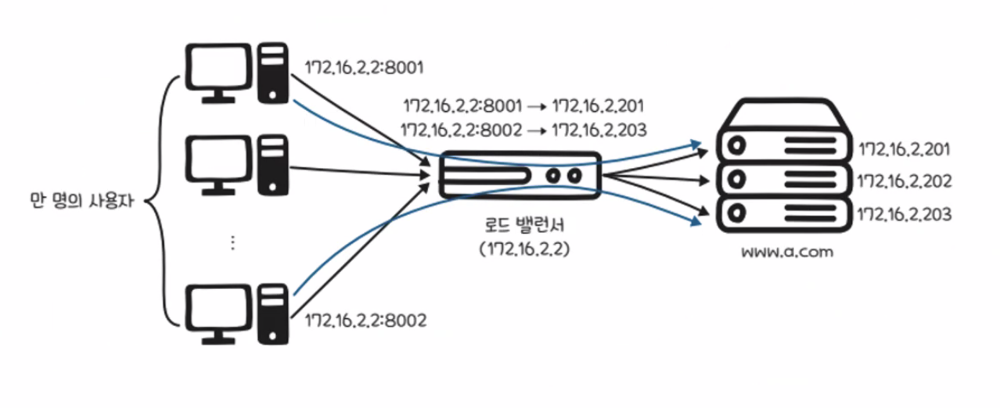
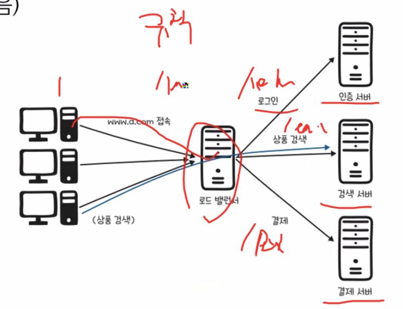
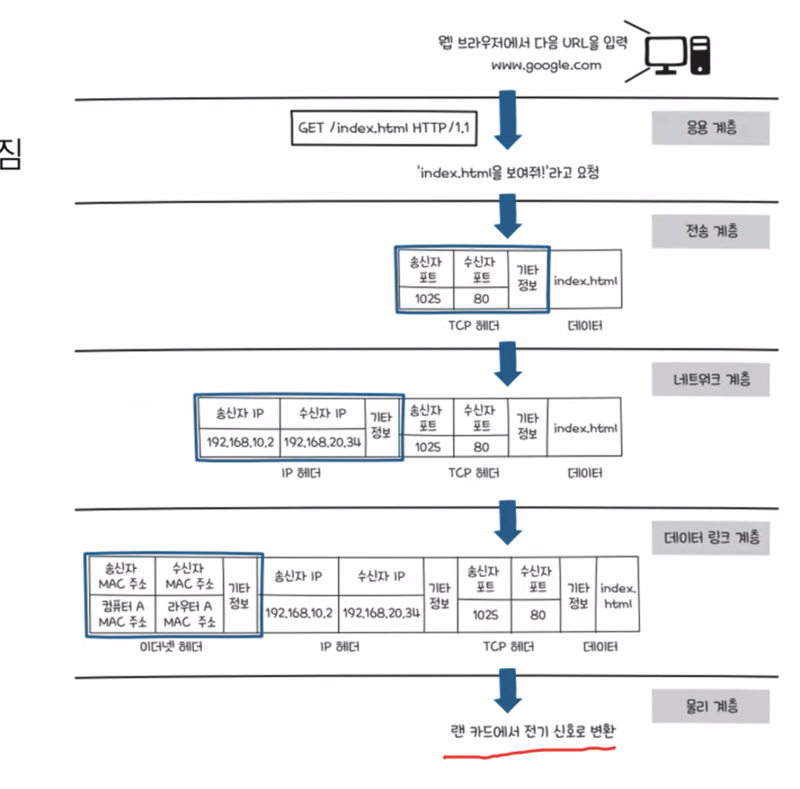

## 2025-02-03
### 스크럼
- 네트워크 개념과 여러 프로토콜들
- QA에 설 연휴간 공부 내용 작성

### 새로 배운 내용
#### 네트워크에 관하여
- 서버, 네트워크, 클라이언트를 고려해야함
- 네트워크
    - 여러 통신장비들이 그물망처럼 연결되어 데이터 교환, 협력하여 일할 수 있게 하는 통신망
- 포트 번호
    - 어플리케이션 구분을 위한 번호
- 헤더
    - 계층을 지나면서 덧붙여지는 정보
- 캡슐화와 역캡슐화

- 캡슐화    
    - 헤더가 붙는 현상? 과정?
- 역캡슐화
    - 헤더가 떨어져 나가는 과정
- 리피터 : 1대1로 감쇠 신호를 증폭 시킴
- 허브 : 물리계층 장비, 리피터 확장버전, 신호 정형, 왜곡 보정, 입력 신호 복제 후 분배 + 네트워크 확장 지원 -> 더미허브가 맞는 표현인듯 
- 더미허브 : 대역폭이 연결된 PC만큼 감소 -> 스위치 허브로 극복 가능

- 데이터 계층 : 회선 제어, 오류 제어, 흐름 제어
- 이더넷과 CSMA/CD 
- 핑 주고 받는 맥주소 프로토콜?? ARP?? 허브를 통해 브로드캐스트 통신

- 위 동작 방식 자체가 ARP
- 주기적으로 브로드캐스트 통신으로 업데이트 -> 허브에서 MAC 테이블을 가짐
- MAC 주소 환경은 LAN 환경에서만 가능(반드시 그런건 아님)

#### 허브와 스위치의 차이
- 거의 비슷함
- 허브는 컴퓨터가 데이터를 전송 -> 허브에 물린 모든 컴퓨터에 전송
- 비효율적임
- 스위치는 이걸 효율적으로 해줌
- 스위치의 MAC 테이블 관리
    - 포트와 맥주소를 테이블 형태로 관리
    - ex) 1번 포트는 ***** 맥주소를 지닌다.
    - 맥 테이블을 통해 이미 할당되어있는 맥 주소면 브로드캐스트 하지 않는다는 느낌

- ARP 과정

- 라우터 없이는 WAN 넘어있는 PC의 맥주소는 알 수 없다.
- ISP -> 라우터(IP | WAN) -> 스위치(MAC | LAN) -> PC

- 네트워킹 계층의 역할 : 라우팅

#### 주제 2: 주제에 대한 설명

- DNS 서버 어쩌구
- 서브넷팅 : 네트워크를 좀 더 작은 네트워크로 나누는 과정
- 호스트 ID 부분을 쪼갬

- 데이터 관점?

- 장비 관점?

- 전송 계층에서 사용하는 LB

- 응용 계층에서 사용하는 LB

- IPSec : 방화벽을 통해 터널링
    - 3계층 : IP 단계에서 암호화
    - 장기적 운용
- ssl vpn : 
    - 4계층~7계층 :전송 계층(TLS)에서 암호화
    - 간단한 업무처리 

### 오늘의 회고
- 오늘은 네트워크 이론 수업을 들었다. 꽤 많은 양이어서 강의 자료나 영상없이 수업 중간 중간에 일부 작성한 TIL 내용을 가지고 찾아보며 공부할 수 밖에 없었다😭
- 이렇게 공부하니 오늘 배운 내용들 어떤 것들은 빠트린게 아닐까 의심이 된다. 내일 강의 자료를 주신다면 다시 한 번 정리해볼 계획이다..!! 이론 공부할 수 있을 때 제대로 익히고 싶다.
- 실제로 많이 빠트렸고, 클라우드 수업 학생들의 배움일기도 꽤나 적었다. 참고해서 적어보려 했지만, 계층에 따른 분류로 설명하던 내용을 찾을 수 없어서 내가 작성한 내용만 담기로 했다. 내일 다듬어보아야겠다.
### 참고 자료 및 링크
- [링크 제목](URL)
- [링크 제목](URL)
