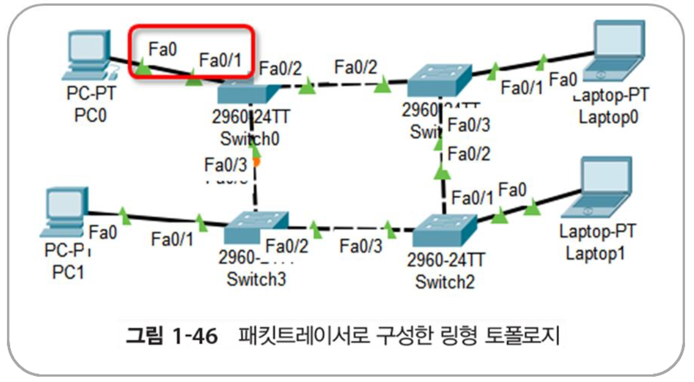

## 2025-02-04

### 스크럼
- 패킷 트레이서 설치
- 네트워크 구성도 그리기
- 실제 구성하기

### 새로 배운 내용
#### 네트워크 구성 종류
- 버스 형

- 링(ring) 형

- 성(start) 형

- 그물(mesh) 형

- 트리 형

#### VLAN에 관하여
- VLAN : 하나의 물리적 네트워크를 논리적으로 나누는 기술
    - 특징 : 같은 스위치에 연결된 장치들을 VLAN으로 나누면 서로 통신할 수 없다.
    - 장점
        1. 보안 강화 
        2. 물리적으로 나누지 않아도 됨
        3. 브로드캐스트 범위가 줄어서 효율이 좋아짐
- Trunk : 여러 VLAN의 트래픽을 하나의 링크로 전달하는 방식
- Inter-VLAN 라우팅 : VLAN끼리 통신을 가능하게 하는 기술

### 오늘의 도전 과제와 해결 방법
- 네트워크 구성도 그리기
    | |IP|Subnet|
    |-|-|-|
    |**PC0**|192.168.0.1|255.255.255.0|
    |**Laptop0**|192.168.0.2|255.255.255.0|
    |**PC1**|192.168.0.3|255.255.255.0|
    |**Laptop1**|192.168.0.4|255.255.255.0|
5. 통신 확인
- 실제 구성하기
    - 어떻게 구성해야할지 몰라서 일단 실습 따라하기로 함.
#### LAN 토폴로지(버스형)
1. 노드 만들기

2. 스위치 노드 만들기

3. 노드 연결

- 스위치들끼리도 연결해야 함.

    -> 주황불이다가 기다리니 초록으로 바뀜
4. IP 주소 설정

    - PC0 -> PC1 통신 확인
    
    - Laptop0, Laptop1 확인
    
    - Laptop0 -> *
    
    - PC1 -> *
    
    - Laptop1 -> * 
    
#### LAN 토폴로지(링형)
- 기존 버스형에서 Switch1 <-> Switch4 연결

#### LAN 토폴로지(그물형)
- 모든 스위치 연결

#### LAN 토폴로지(성 형)
- 스위치 하나에 모두 연결

#### LAN 토폴로지(트리 형)
- 다수의 성형 네트워크의 스위치를 하나의 중앙 스위치와 연결

### 오늘의 회고
- 오늘의 학습 경험에 대한 자유로운 생각이나 느낀 점을 기록합니다.
- 성공적인 점, 개선해야 할 점, 새롭게 시도하고 싶은 방법 등을 포함할 수 있습니다.

### 참고 자료 및 링크
- [링크 제목](URL)
