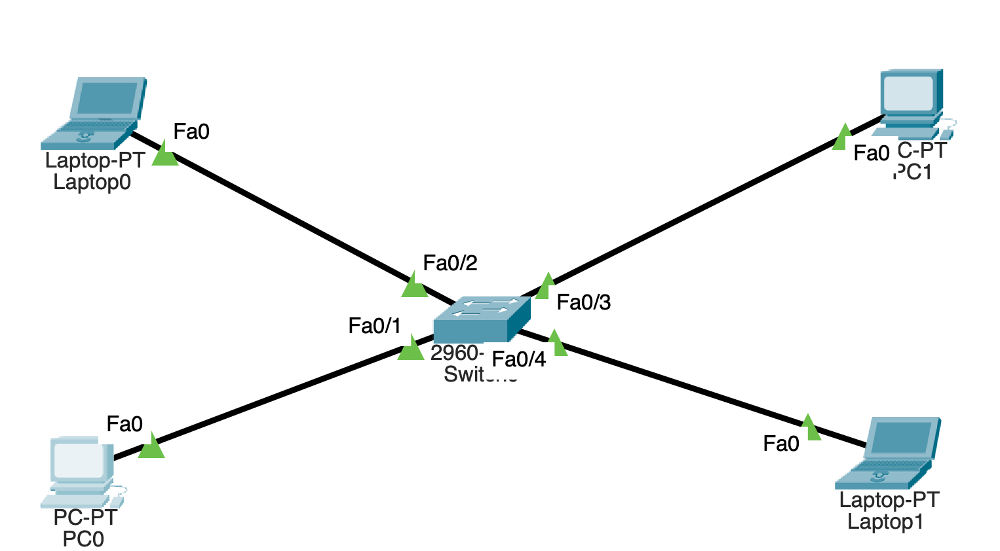
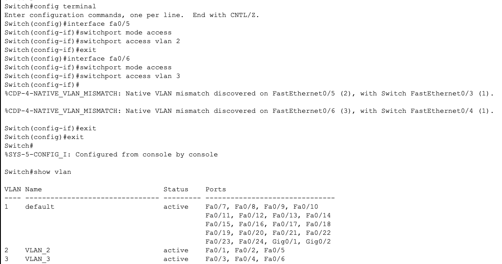
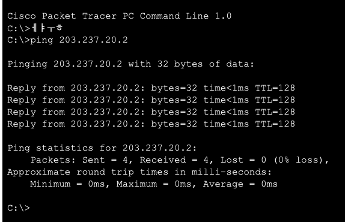

## 2025-02-04

### 스크럼
- 패킷 트레이서 설치
- 네트워크 구성도 그리기
- 실제 구성하기
-> 흐름 파악이 목적

### 새로 배운 내용
#### 네트워크 구성 종류
- 버스 형

- 링(ring) 형

- 성(start) 형

- 그물(mesh) 형

- 트리 형


#### VLAN에 관하여
- VLAN : 하나의 물리적 네트워크를 논리적으로 나누는 기술
    - 특징 : 같은 스위치에 연결된 장치들을 VLAN으로 나누면 서로 통신할 수 없다.
    - 장점
        1. 보안 강화 
        2. 물리적으로 나누지 않아도 됨
        3. 브로드캐스트 범위가 줄어서 효율이 좋아짐
- Trunk : 여러 VLAN의 트래픽을 하나의 링크로 전달하는 방식
- Inter-VLAN 라우팅 : VLAN끼리 통신을 가능하게 하는 기술

### 오늘의 도전 과제와 해결 방법
- 네트워크 구성도 그리기
    | |IP|Subnet|
    |-|-|-|
    |**PC0**|192.168.0.1|255.255.255.0|
    |**Laptop0**|192.168.0.2|255.255.255.0|
    |**PC1**|192.168.0.3|255.255.255.0|
    |**Laptop1**|192.168.0.4|255.255.255.0|
5. 통신 확인
- 실제 구성하기
    - 어떻게 구성해야할지 몰라서 일단 실습 따라하기로 함.
#### LAN 토폴로지(버스형)
1. 노드 만들기

2. 스위치 노드 만들기


3. 노드 연결


- 스위치들끼리도 연결해야 함.

    -> 주황불이다가 기다리니 초록으로 바뀜
4. IP 주소 설정

    - PC0 -> PC1 통신 확인
    
    - Laptop0, Laptop1 확인
    
    - Laptop0 -> *
    
    - PC1 -> *
    
    - Laptop1 -> * 
    
#### LAN 토폴로지(링형)
- 기존 버스형에서 Switch1 <-> Switch4 연결

#### LAN 토폴로지(그물형)
- 모든 스위치 연결

#### LAN 토폴로지(성 형)
- 스위치 하나에 모두 연결

#### LAN 토폴로지(트리 형)
- 다수의 성형 네트워크의 스위치를 하나의 중앙 스위치와 연결

-> 동영상보고 다음과 같이 포트번호 보이게 변경


#### VLAN 구성
- 현재 네트워크 구성 상태

    | |IP|Subnet|
    |-|-|-|
    |**PC0**|192.168.0.1|255.255.255.0|
    |**Laptop0**|192.168.0.2|255.255.255.0|
    |**PC1**|192.168.0.3|255.255.255.0|
    |**Laptop1**|192.168.0.4|255.255.255.0|

- vlan 생성 후 확인

- vlan 포트 지정

- 확인


- PC0 -> Laptop0 (O) | PC0 -> PC1 (1)


#### 트렁크
- 위 VLAN에서 아래와 같이 확장을 하고 싶다..!

- IP도 위와 같이 변경해야겠다.

- VLAN 별 IP 주소 대역대
    | |IP|
    |-|-|
    |**VLAN2**|203.237.20.nnn|
    |**VLAN3**|203.237.30.nnn|
- Switch1 vlan 설정 + 확인

- 이럴 수가 가상화로 다 되는줄 알았는데 여기선 회선 2개로 분리를 한다...

- Switch0 : fa0/5->vlan2, fa0/6->vlan3
    ```
    Switch>
    Switch>enable
    Switch#config terminal
    Enter configuration commands, one per line.
    Switch (config) #interface fa0/5
    Switch (config-if) #switchport mode access
    Switch (config-if)#switchport access vlan 2
    Switch (config-if)#exit
    Switch (config)#interface fa0/6
    Switch (config-if)#switchport mode access
    Switch (config-if) #switchport mode vlan 3
    Switch (config-if) #exit
    Switch (config) #exit
    ```
    
- Switch1 : fa0/3->vlan2, fa0/4->vlan3
    ```
    Switch>
    Switch>enable
    Switch#config terminal
    Enter configuration commands, one per line.
    Switch (config)#interface fa0/3
    Switch (config-if)#switchport mode access
    Switch (config-if)#switchport access vlan 2
    Switch (config-if)#exit
    Switch (config)#interface fa0/4
    Switch (config-if)#switchport mode access
    Switch (config-if)#switchport access vlan 3
    Switch (config-if) #exit
    Switch (config) #exit
    Switch#
    ```
    
- 조금 다르긴하지만 완성

- PC0 -> PC1

- Laptp1 -> Laptop2

- 위와 같이해버리면 VLAN 1개당 스위치에 연결해야할 회선이 1개씩 늘어남

- 따라서 트렁크를 통해 회선 하나로 이용가능하다
- 트렁크가 모든 VLAN 패킷을 통과시켜줌
- fa0/5
    ```
    Switch>enable
    Switch#config terminal
    Enter configuration commands, one per line.  End with CNTL/Z.
    Switch(config)#interface fa0/5
    Switch(config-if)#switchport mode trunk

    Switch(config-if)#
    %LINEPROTO-5-UPDOWN: Line protocol on Interface FastEthernet0/5, changed state to down

    %LINEPROTO-5-UPDOWN: Line protocol on Interface FastEthernet0/5, changed state to up

    %CDP-4-NATIVE_VLAN_MISMATCH: Native VLAN mismatch discovered on FastEthernet0/5 (1), with Switch FastEthernet0/3 (2).

    Switch(config-if)#
    %CDP-4-NATIVE_VLAN_MISMATCH: Native VLAN mismatch discovered on FastEthernet0/5 (1), with Switch FastEthernet0/3 (2).

    Switch(config-if)#ㄷㅌ
    Switch(config-if)#exit
    Switch(config)#exit
    Switch#
    %SYS-5-CONFIG_I: Configured from console by console
    show interface trunk
    Port        Mode         Encapsulation  Status        Native vlan
    Fa0/5       on           802.1q         trunking      1

    Port        Vlans allowed on trunk
    Fa0/5       1-1005

    Port        Vlans allowed and active in management domain
    Fa0/5       1,2,3

    Port        Vlans in spanning tree forwarding state and not pruned
    Fa0/5       1,2,3
    ```
- fa 0/3
    ```
    Switch>enable
    Switch#config terminal
    Enter configuration commands, one per line.  End with CNTL/Z.
    Switch(config)#interface fa0/3
    %CDP-4-NATIVE_VLAN_MISMATCH: Native VLAN mismatch discovered on FastEthernet0/3 (2), with Switch FastEthernet0/5 (1).

    Switch(config-if)#switchport mode trunk

    Switch(config-if)#
    %LINEPROTO-5-UPDOWN: Line protocol on Interface FastEthernet0/3, changed state to down

    %LINEPROTO-5-UPDOWN: Line protocol on Interface FastEthernet0/3, changed state to up

    Switch(config-if)#exit
    Switch(config)#exit
    Switch#
    %SYS-5-CONFIG_I: Configured from console by console

    Switch#show interface trunk
    Port        Mode         Encapsulation  Status        Native vlan
    Fa0/3       on           802.1q         trunking      1

    Port        Vlans allowed on trunk
    Fa0/3       1-1005

    Port        Vlans allowed and active in management domain
    Fa0/3       1,2,3

    Port        Vlans in spanning tree forwarding state and not pruned
    Fa0/3       none

    Switch#
    ```
- VLAN안에서만 통신되는지 확인해보자
    
    - PC2 -> Laptop0 (VLAN 2)
    
    - PC1 -> Laptop2 (VLAN 3)
    
정상작동중..!

### 오늘의 회고
- VLAN 이름 변경 -> 연결할 포트 VLAN에 넣기 -> show vlan으로 확인
- 트렁크하면서 VLAN이 완전한 논리적 분리가 아니라 물리적 분리도 일부 섞을 수 있다는 것을 알았다. 인줄 알았는데 이게 트렁크를 쓰는 이유였다...
- 근데 이게 맞는 생각인지 모르겠다.

### 참고 자료 및 링크
- [GNS3](https://www.gns3.com/)
    ------
    vmware만들어서 모듈 하나하나 심음
    -> 클라우드랑 연동됨 -> 재밌음