## 2025-02-05

### 스크럼
- Inter-VLAN 실습 마저 끝내고 오늘자 실습 안밀리고 하기
- 굉장히 피곤함..
- 트렁크까지 랜토폴로지 실습 마침
- 나름 재미있었다. 시간을 꽤 많이써서 오늘은 알뜰살뜰하게 해보려고 한다…!!! ❤️‍🔥

### 새로 배운 내용
#### Inter-VLAN
- VLAN은 통신 제한이 목표가 아님
- LAN을 편리하게 사용하기 위함
- 따라서 VLAN간 통신을 위한 라우터를 추가해줘야함
- 라우터를 경유하여 다른 VLAN으로 통신
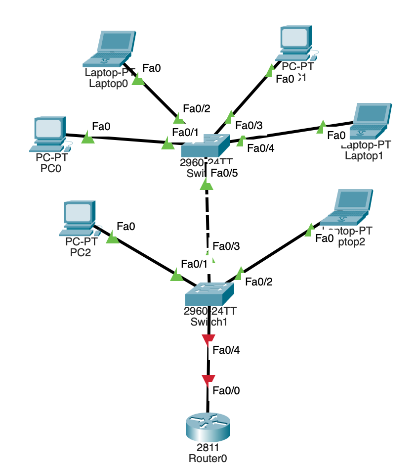
- 그런데 하나의 인터페이스에 두 IP주소 할당 불가
    - VLAN2, VLAN3
- 라우터의 fa0/0이 VLAN_2와 VLAN_3의 게이트웨이 역할 불가
- 그렇다면 회선 2개를 쓰거나 가상 회선(서브 인터페이스)
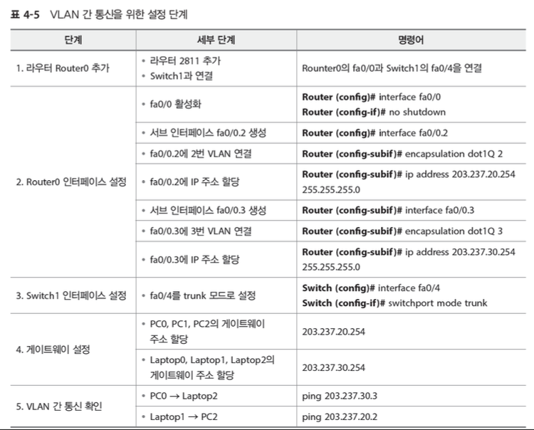

#### 주제 2: 주제에 대한 설명
- 상세 내용 1
- 상세 내용 2

### 오늘의 도전 과제와 해결 방법
#### Inter-VLAN 실습
- Router0의 서브 인터페이스 설정
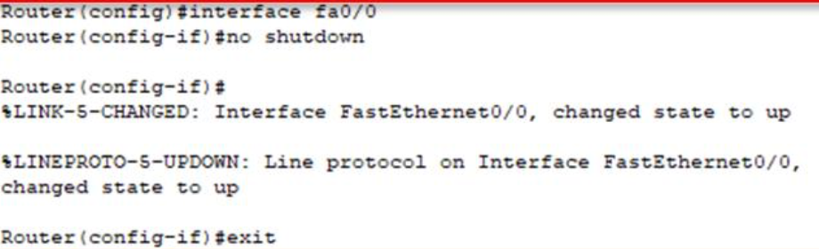
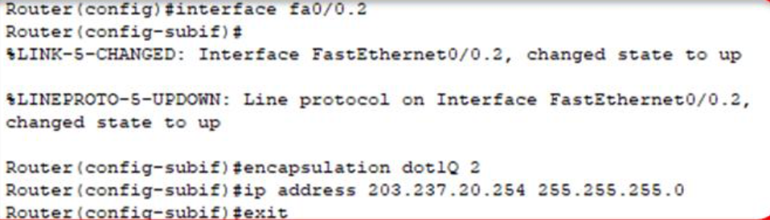
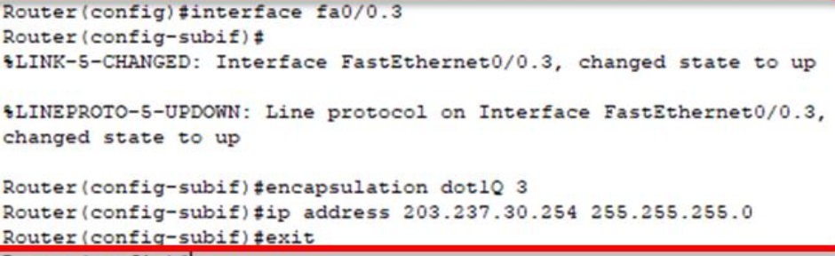
- 상태 확인
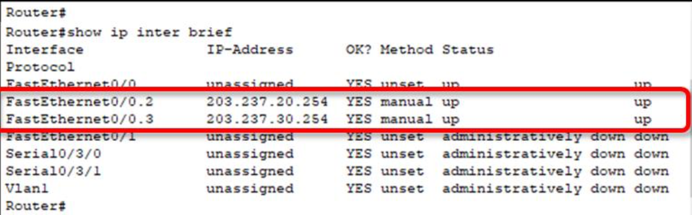
1. 실습(라우터 설정)
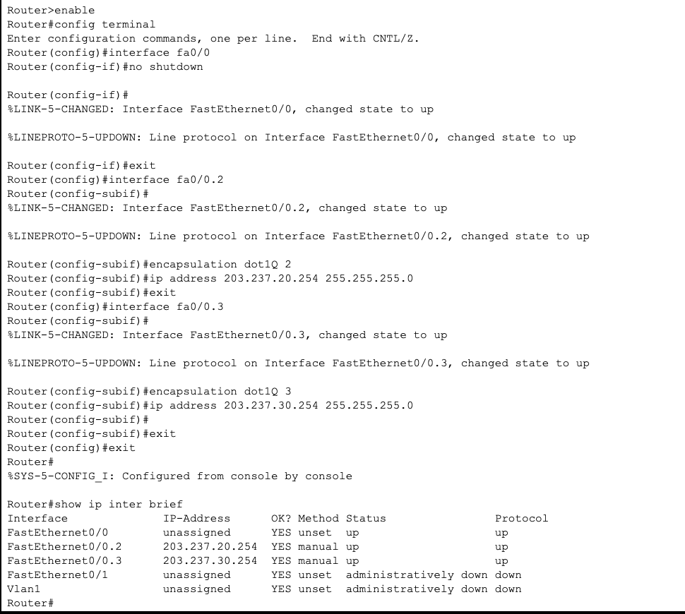
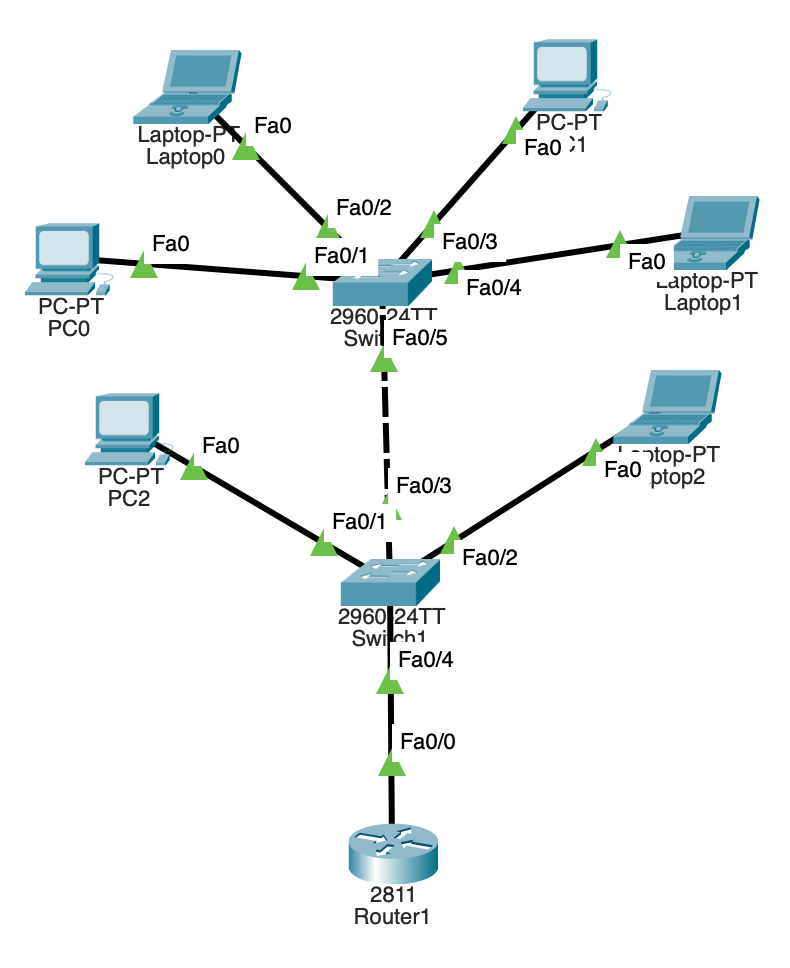
    - 연결됨
2. 실습(스위치1)
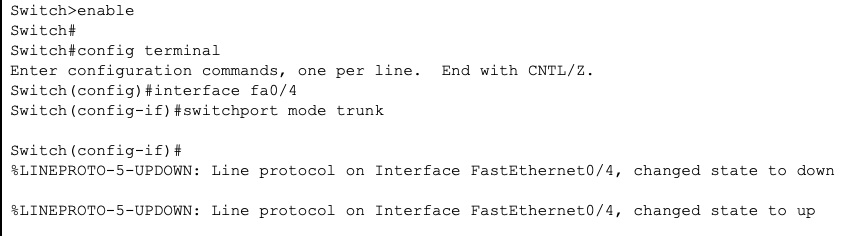
3. 게이트웨이 설정
- VLAN2(203.237.20.254)
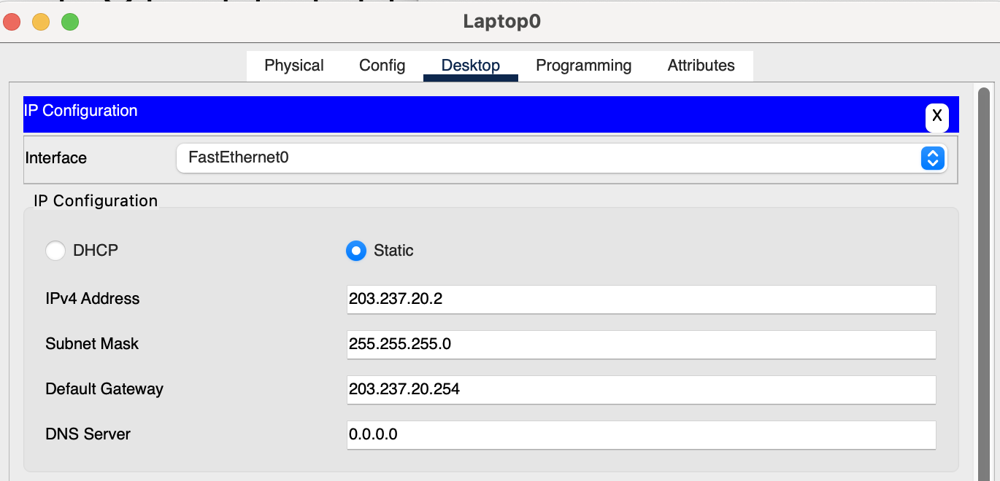
- VLAN3(203.237.30.254)
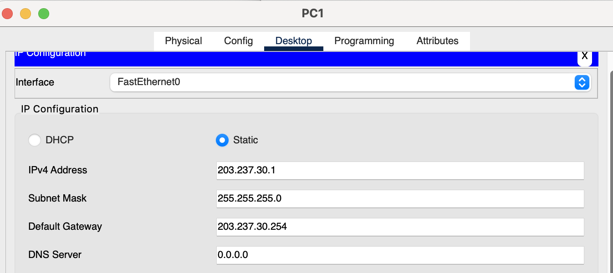
4. VLAN2 <-> VLAN3 통신 확인
- Laptop2(3) -> Laptop0(2)
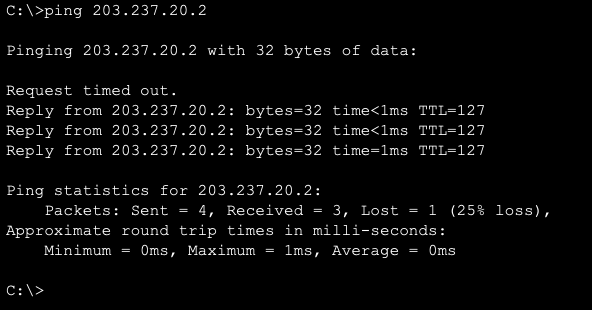
- PC0(2) -> Laptop1(3)
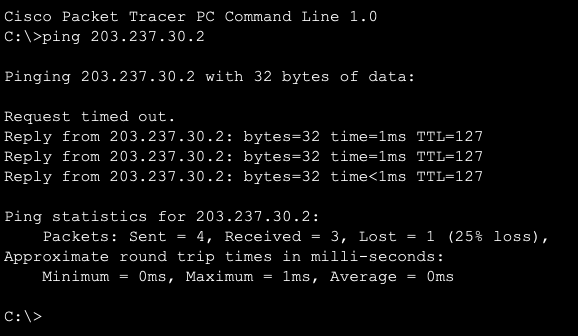
- 완성된 사진
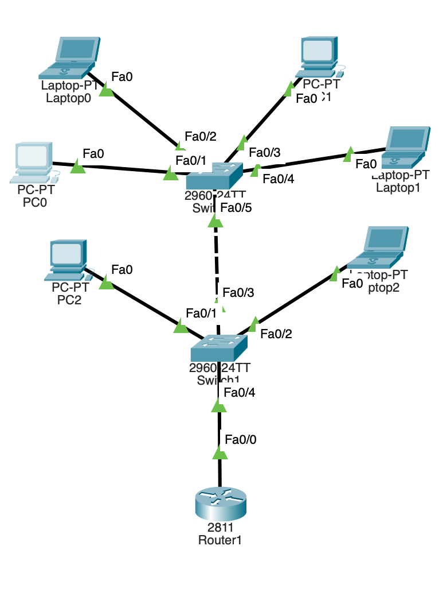
### 오늘의 회고
- 새롭고 재밌는데 시간을 꽤 많이 소요하게 된다. 내일은 집중해서 과제를 시작할 수 있도록 하자...
- Inter-VLAN을 하는 이유를 굳이? 라고 생각했지만 결국 LAN끼리의 통신이라고 생각하니 이해가 조금 되었다.
- 비효율적이라고 생각한 것과 반대로 효율과 보안을 잡기 위해 사용하는구나...!

### 참고 자료 및 링크
