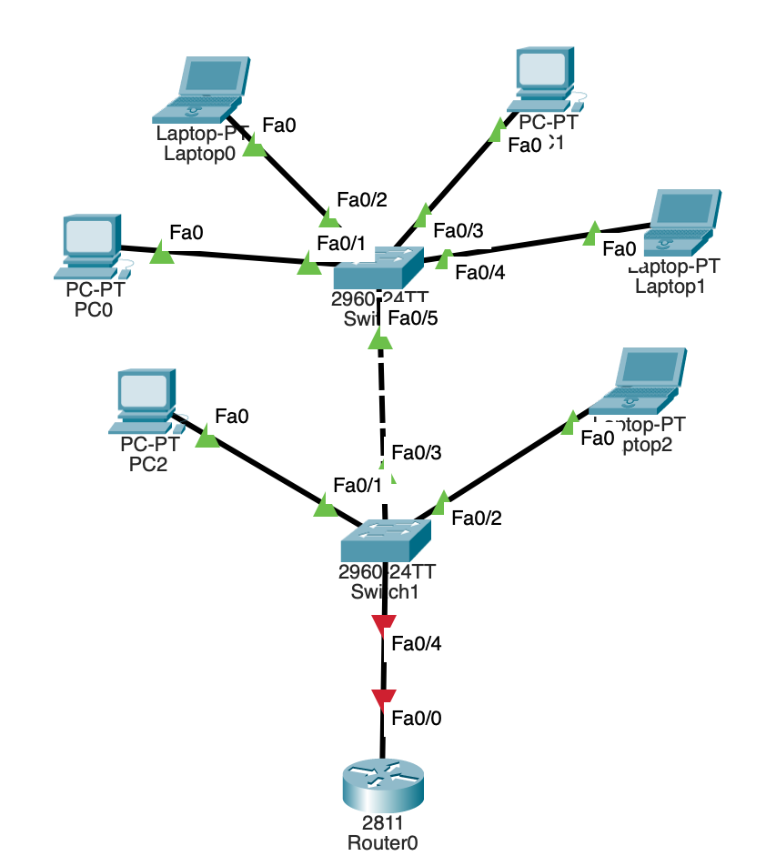
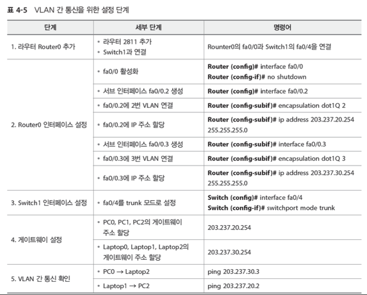

## 2025-02-05

### 스크럼
- Inter-VLAN 실습 마저 끝내고 오늘자 실습 안밀리고 하기
- 굉장히 피곤함..
- 트렁크까지 랜토폴로지 실습 마침
- 나름 재미있었다. 시간을 꽤 많이써서 오늘은 알뜰살뜰하게 해보려고 한다…!!! ❤️‍🔥

### 새로 배운 내용
#### Inter-VLAN
- VLAN은 통신 제한이 목표가 아님
- LAN을 편리하게 사용하기 위함
- 따라서 VLAN간 통신을 위한 라우터를 추가해줘야함
- 라우터를 경유하여 다른 VLAN으로 통신

- 그런데 하나의 인터페이스에 두 IP주소 할당 불가
    - VLAN2, VLAN3
- 라우터의 fa0/0이 VLAN_2와 VLAN_3의 게이트웨이 역할 불가
- 그렇다면 회선 2개를 쓰거나 가상 회선(서브 인터페이스)

#### 주제 2: 주제에 대한 설명
- 상세 내용 1
- 상세 내용 2

### 오늘의 도전 과제와 해결 방법
#### Inter-VLAN 실습

- 도전 과제 2: 도전 과제에 대한 설명 및 해결 방법

### 오늘의 회고
- 오늘의 학습 경험에 대한 자유로운 생각이나 느낀 점을 기록합니다.
- 성공적인 점, 개선해야 할 점, 새롭게 시도하고 싶은 방법 등을 포함할 수 있습니다.

### 참고 자료 및 링크
- [링크 제목](URL)
- [링크 제목](URL)
