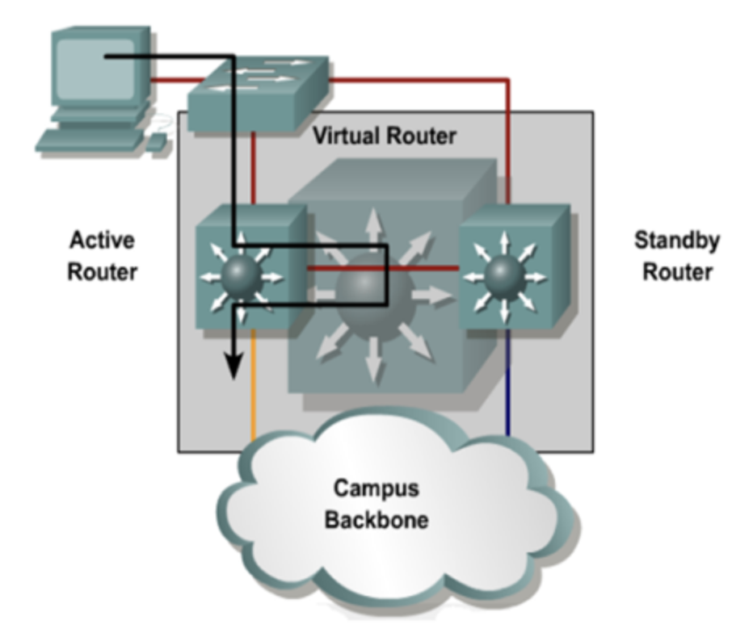

## 2025-02-07

### 스크럼
- 딥다이브, 이론공부 + 과제 구성도 구상하기
- 불금임
- 네트워크 이론만 계속 본듯
- 시간만 많이 쓰고 능률은 안나오는듯 → 맨날 반성함
- 이때까지 TIL 너무 준구 난방 다 적은 것 같다.
- 이젠 실습+공부 이후에 작성 (가독성 올리고 분량 줄이기)

---

### 새로 배운 내용(딥다이브) : 고가용성 + 이중화 설계
#### 딥다이브 : HSRP와 VRRP 비교 실습
- 게이트웨이 이중화 -> 가용성 + 신뢰성 높아짐

##### HSRP
    1. 시스코 표준
    2. VIP 하나로 기본 및 백업 라우터 관리
    3. 빠르고 간단함(주로 VLAN)
##### VRRP
    1. IBM에서 사용
    2. 시스코 장비 및 그 이외의 장비에서도 사용 가능
    (주로 물리 인터페이스)
    3. 링 토폴로지에서 괜찮음
#### 딥다이브 : LACP 기반 Link Aggregation 설정 및 성능 테스트
##### Link Aggregation
- 여러 포트링크를 하나로 묶어서 사용(논리적)
- 대역폭을 늘림
##### LACP
- Link Aggregation Control Protocol
- 표준화된 Link Aggregation
- 모든 물리 인터페이스 Active상태로 지정
-> 물리 인터페이스 수만큼 확장 가능
- 논리 인터페이스를 구성하는 물리 인터페이스 장애 발생해도 나머지로 서버 유지 가능
- 단점
    - 대역폭과 전체 서비스 트래픽이 동일하게 유지되면 장애 발생시 나머지가 감당 못함
    - 물리 인터페이스들의 속도가 동일해야함

#### 딥다이브 : 네트워크 장애 복구 시뮬레이션 (Failover & Load Balancing 설정)
##### Failover
    장애 발생시 하나 이상의 예비 백업 노드로 자동 전환(자동)

#### 딥다이브 : CDP(또는 LLDP)를 이용한 네트워크 자동 탐색 및 최적화
##### CDP
    Cisco 장비만 유효
##### LLDP
    IEEE 표준

---
### 오늘의 도전 과제와 해결 방법
1. HSRP와 VRRP 비교 실습
    - 게이트웨이 이중화
2. LACP 기반 Link Aggregation 설정 및 성능 테스트
3. 네트워크 장애 복구 시뮬레이션 (Failover & Load Balancing 설정)
4. CDP(또는 LLDP)를 이용한 네트워크 자동 탐색 및 최적화
-> 노션에 정리됨

### 오늘의 회고
- 딥다이브할때도 전혀 모르는 걸 배우는 느낌이 들었다. 기본적으로 알고 있는 개념의 심화 학습이 되면 좋겠는데 그런 점에서 많이 부족한 것 같다

### 참고 자료 및 링크
- [링크 제목](URL)
