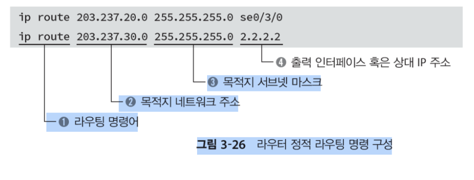
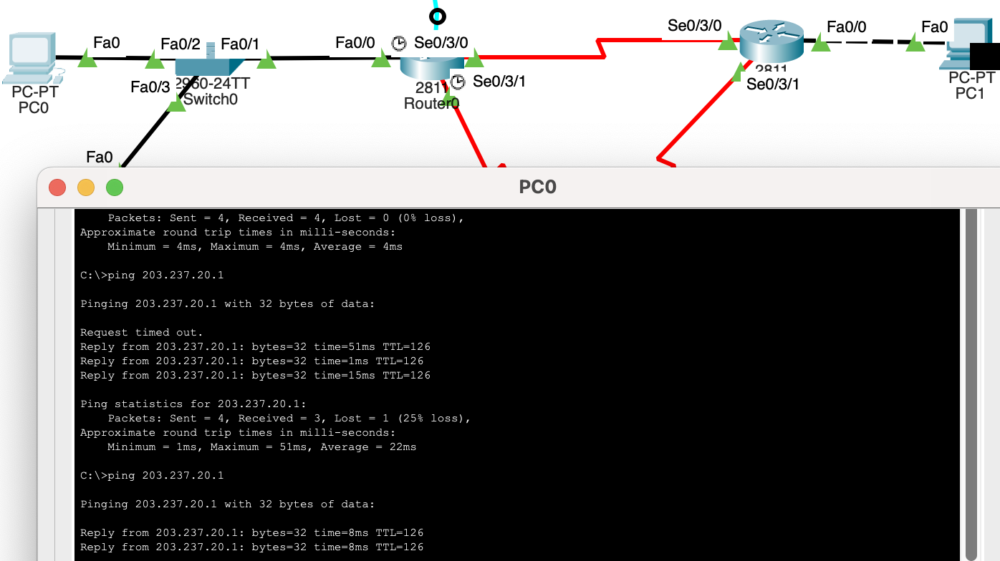

## 2025-02-09

### 스크럼
- 10시에 뻗어서 개운할 줄 알았는데 너무 피곤함.
- 잠시 운동은 쉬어야겠다.
- 이론과 과제를 진행할 계획
- 잠시 병원에 다녀오게 되어 많이 하지는 못할 것 같다.
- 구상보다는 일단 과정을 따라가는 쪽으로 해볼듯
- 8일은 아무것도 못했다.

### 새로 배운 내용
#### 관점에 따른 네트워크의 흐름
##### 송신사 관점

##### 장비 관점

##### 수신자 관점

### 오늘의 도전 과제와 해결 방법
#### 네트워크 구성
- 먼저 구성도 draw.io를 통해 그린다.

- 구성도에 따른 IP
    | 순서 | 노드명    | 인터페이스        | IP 주소          | 서브넷 마스크     | 게이트웨이        |
    |----|---------|-----------------|----------------|---------------|--------------|
    | 1  | Laptop0  | RS232           | -              | -             | -            |
    |    |         | FastEthernet0    | 203.237.10.254 | 255.255.255.0 | -            |
    | 2  | Router0  | Serial0/3/0      | 1.1.1.1        | 255.255.255.252 | -            |
    |    |         | Serial0/3/1      | 2.2.2.1        | 255.255.255.252 | -            |
    |    |         | FastEthernet0/0  | 203.237.20.254 | 255.255.255.0 | -            |
    | 3  | Router1  | Serial0/3/0      | 1.1.1.2        | 255.255.255.252 | -            |
    |    |         | Serial0/3/1      | 3.3.3.1        | 255.255.255.252 | -            |
    | 4  | Router2  | FastEthernet0/0  | 203.237.30.254 | 255.255.255.0 | -            |
    |    |         | Serial0/3/0      | 2.2.2.2        | 255.255.255.252 | -            |
    |    |         | Serial0/3/1      | 3.3.3.2        | 255.255.255.252 | -            |
    | 5  | PC0      | FastEthernet0    | 203.237.10.1   | 255.255.255.0 | 203.237.10.254 |
    | 6  | PC1      | FastEthernet0    | 203.237.20.1   | 255.255.255.0 | 203.237.20.254 |
    | 7  | PC2      | FastEthernet0    | 203.237.30.1   | 255.255.255.0 | 203.237.30.254 |
    | 8  | Server0  | FastEthernet0    | 203.237.10.101 | 255.255.255.0 | 203.237.10.254 |
    |    |         | vlan 1           | 203.237.10.100 | 255.255.255.0 | 203.237.10.254 |
    | 9  | Switch0  | FastEthernet0/1  | -              | -             | -            |
    |    |         | FastEthernet0/2  | -              | -             | -            |
    |    |         | FastEthernet0/3  | -              | -             | -            |
- 패킷 트레이서로 구현

- 라우터들은 FastEthernet X -> 시리얼 사용
- 그런데 설정엔  밖에 없음

    
##### Physical
- 아래와 같은 상황일때

- 전원을 끄고 아래 사진과 같이 만들어준다1.
 ([MODULES] -> HWIC-2T) 부팅까지 해준 상태

##### CLI
1. 
2. [Config] -> Interface에서 생성된 것을 확인

3. 나머지 라우터도 진행

##### 회선 연결
1. 번개모양 선택(자동 회선)

##### IP 연결
- 위 표를 보고 연결

##### 라우터 콘솔
- OK 클릭

- 라우터 cli가 출력되고 있음

- 현재 각 인터페이스 상태

- Router0 - Router1 연결

- Router0 - Switch0 연결

- 스위치와 라우터 연결 : UP

- 남은 라우터끼리의 연결 전부 no shut하기

##### 스위치 IP 주소 설정
- 스위치는 MAC주소 사용
- IP 필요 없지만 원격으로 관리하려면 IP를 할당해야한다.
- vlan 1에 IP 주소 할당

- 3개의 포트와 vlan1이 활성화됨

##### 각 노드마다 연결 확인
- PC0 본인 네트워크 상태(localhost)

- PC0 -> Switch0

- PC0 -> Server0

- PC0 -> Router0

- PC0 -> PC1 : 도달 불가 응답 -> 라우팅 테이블 필요

- 라우팅 테이블 상태

- 정적 라우팅으로 연결되지 않은 곳들도 연결

- Route1 확인하고 연결

- Route2 생략 -> 똑같이 진행

##### 시뮬레이션
- [simulation] -> Event List 창 -> Edit filter -> ICMP만

- 잘 되는 것 같습니다

### 오늘의 회고
- 그 자체로는 어렵지 않은데, 내가 구성을 하고 작성을 하며 맞춰가는게 어려운 것 같다. 시뮬레이션이라 여기저기 만져보며 해결할 수 있었지만, 실제 라우터를 만질 때는 다른 라우터에 있는 엔지니어와 현상황을 브리핑하며 해결해야한다고 생각하니 많이 빡빡한 것 같다. 클라우드는 신인듯

### 참고 자료 및 링크
- [draw.io](https://draw.io/)