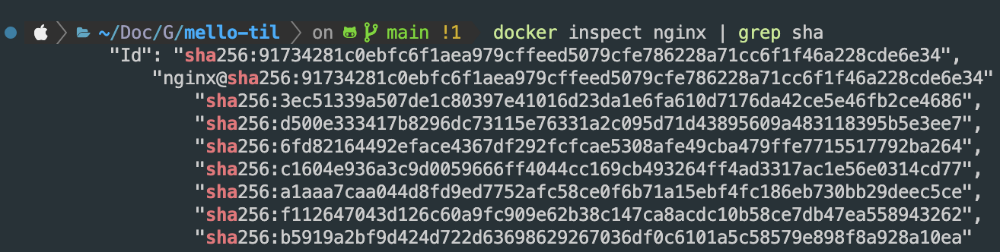
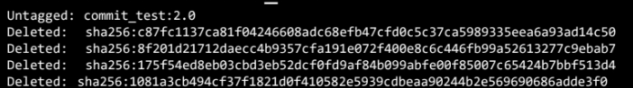

## 2025-02-11

### 스크럼
- 도커 실습 진행할 계획
- 도커 이론(수업따라서) 진행했음
- 피곤한 상태, 일찍 자야할듯
- 클램폴린 IDE 특강 수업

### 새로 배운 내용
#### 도커 이미지 생성 방법
##### 컨테이너로 이미지 생성
1. OS 이미지로 컨테이너 생성
2. 애플리케이션 설치 및 환경설정, 소스코드 복제
3. 컨테이너 이미지 커밋

##### 도커파일로 이미지 생성
1. 작업 기록한 도커파일 생성

2. 빌드 명령어가 도커파일 읽어서 이미지 생성


##### 이미지 생성 시나리오
1. 도커 허브에서 nginx 이미지 불러옴
2. 컨테이너로 동작
3. nginx index.html 수정
4. 저장 -> 새 commit_test:1.0 이미지로 만듦
5. commit_test:1.0 이미지로 새 컨테이너 구동
6. 새로운 index.html을 host에서 cp
7. 해당 컨테이너 그대로 이미지화 -> commit_test:2.0

##### 과정 중 사용자가 도커에게 줄 권한
- 도커 실행마다 sudo 쓰는거 번거로움
- 로그인된 사용자에게 도커 sudo 권한 부여
- 아래의 명령어 작성 -> ubuntu 끄고 다시 키기
```bash
$ sudo user -aG docker $USER
$ Logout
$ Power off
```
##### 도커 이미지 생성 과정
1. 컨테이너 생성
```bash
$ docker run -it --name commit_test_container -p 9999:80 nginx
```
2. index.html 수정
```bash
$ find / -name index.html
/usr/share/nginx/html/index.html
$ apt-get udpate
```
3. Hello가 나오는 index.html로 교체 혹은 수정

4. 도커 이미지 생성
    - docker commit [opt] container [repository[:tag]]
    - -a: author(이미지 작성자) 메타 데이터를 이미지에 저장
    - -m: 커밋 메시지 입력
5. index.html 변경 확인하기 -> localhost:9999


6. 생성된 이미지로 다시 컨테이너 생성
```bash
$ docker run -d --name commit_test2_container \ -p 8888:80 commit_test:1.0
```

7. nginx 동작 확인(localhost:8888)

8. index.html 변경 - docker cp
```bash
$ docker cp /home/ubuntu/index.html
commit_test2_container:/usr/share/ngnix/html/index.html
```

9. 도커 이미지 생성
```bash
$ docker commit \
-a "user1" -m "my second commit" \
commit_test2_container \
commit_test:2.0
```

10. 이미지 생성 확인
```bash
$ docker images
```

@TO-DO@TO-DO@TO-DO@TO-DO@TO-DO@TO-DO@TO-DO
##### 이미지 레이어
- 도커 이미지에 대한 정보를 볼 수 있음
    ```bash
    $ docker inspect <이미지명>
    ```
    
##### 이미지 기능들
- 도커 이미지 history 확인
```bash
$ docker history <이미지명>
```
- 도커 이미지 삭제
```bash
$ docker rmi <이미지명>
```
- 컨테이너 사용중인 이미지는 삭제 불가
- 컨테이너 삭제 후 이미지 삭제 가능
```bash
$ docker stop <컨테이너>
$ docker rm <컨테이너>
$ docker rmi <이미지>
Untagged: <이미지명>
# 이미지 레이어에 붙은 이름만 삭제됨
# 실제 레이어는 남아있다 -> 다른 이미지 레이어가 참조하고 있음 
```
- 아래처럼 deleted 메시지가 떠야함


#### 크램폴린 IDE
- 이미지 : 클래스 -> 컨테이너 : 인스턴스

### 오늘의 회고
- 도커 자체는 어렵지 않은데 개념을 너무 모르는 것 같다. 익혀나가는 과정이 필수
- 크램폴린 IDE도 실습 시작해야겠다.

### 참고 자료 및 링크
- [링크 제목](URL)
