## 2025-02-12

### 스크럼
- 도커 파일, 도커 이미지 배포, 도커 볼륨 실습
- 크램폴린 IDE
- Gitlab & Gitlab runner 구성
- docker-compose

### 새로 배운 내용
#### 도커 이미지 배포 3가지
##### public registry
- 구조
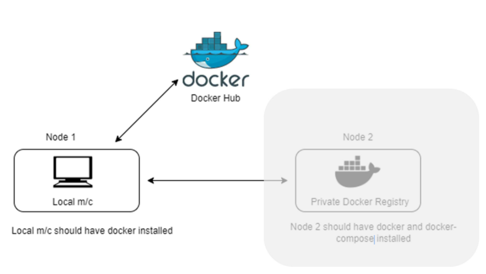
- 도커 허브에서 이미지 검색 : 우분투
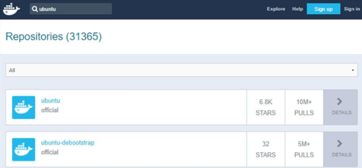
- 저장소 이름 : 본인ID/이미지이름 으로 저장됨
- 이미지 올리는 과정
    - 컨테이너를 이미지로 만들기
        ```bash
        $ docker commit [현재 있는 컨테이너] dmimage:0.0
        ```
    - 이미지 이름 부여
        ```bash
        $ docker tag dmimage:0.0 ID/imgName:버전(0.0)
        $ docker images # 이미지 목록 확인
        ```
        - docker tag [기존 이미지 이름] [새로 생성할 이름]
        - dmimage:0.0 [본인ID]/dmimage:0.0
        - tag : 기존 이미지에 이름만 추가. image id는 동일함
        - 기존 이미지도 남아있음
        - myserver를 저장소에 올리기
        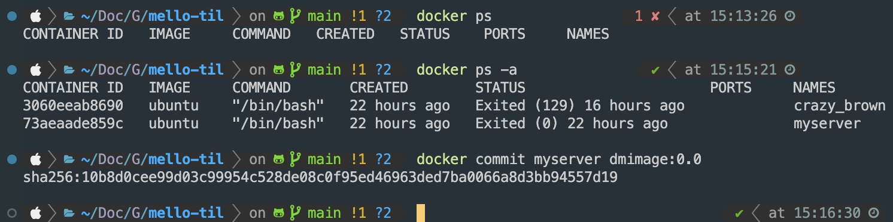
        - 이미지 이름 주기
        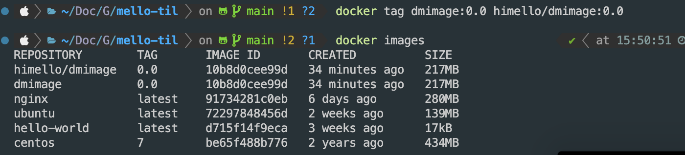
    - 도커 허브 로그인
        ```bash
        $ docker login
        ```
        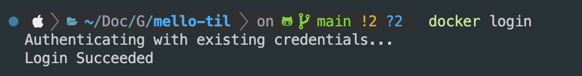
    -  이미지 업로드
        ```bash
        $ docker push 본인ID/dmimage:0.0
        ```
        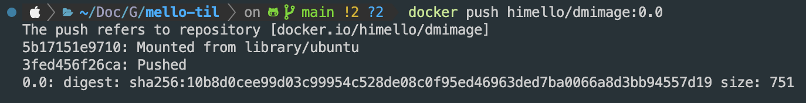
    - 이미지 내려받기(컨테이너 중지 -> 삭제)
        ```bash
        $ docker stop myserver
        $ docker rmi id/dmimage:0.0
        ```
        - push?혹은 login이후 ID/이미지명 -> 이미지명으로 변경됨
        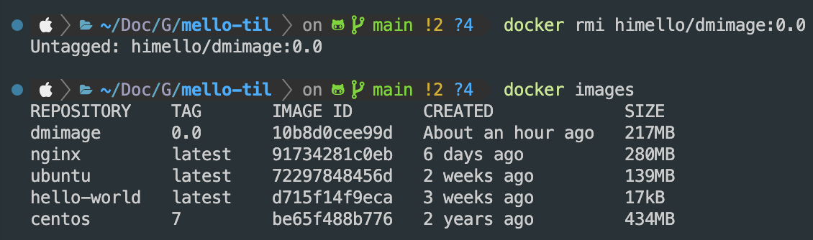
    - 따라서 아래와 같이 수정하여 삭제
        ```bash
        $ docker rmi dmimage:0.0
        ```
        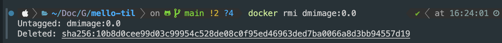
    - 이미지 목록은 아래 처럼 볼 수 있음(rmi로 이미지 삭제됨)
        ```bash
        $ docker images
        ```
        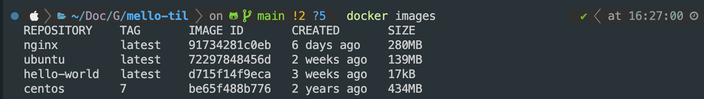
    - 이미지 내려받기(pull)
        ```bash
        $ docker pull id/dmimage:0.0
        ```
        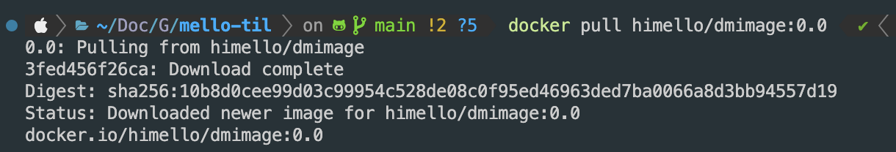
    - 이미지 리스트에 pull된 것을 확인할 수 있음
        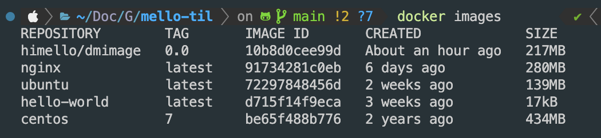

##### private registry
- 구조
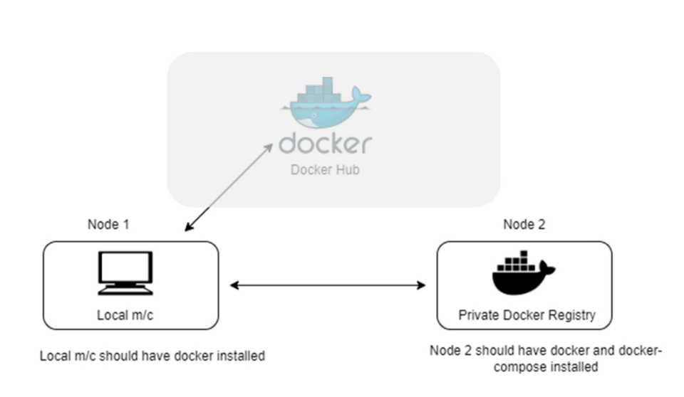
- 개념 : 자체 운영하는 도커 이미지 저장소
- 기업 내부, 혹은 개인 프로젝트용 -> 보안이 docker hub에 비해 강화됨
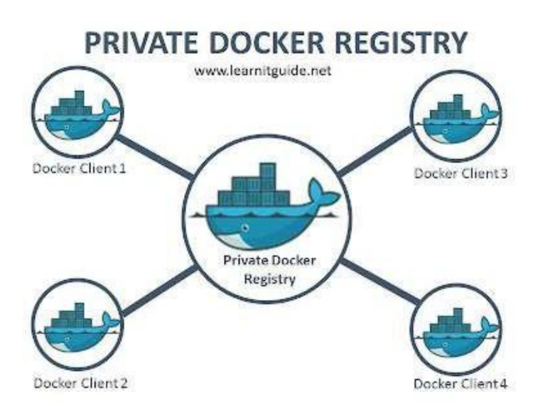
- 순서
    1. 우분투 설치 -> 그냥 맥에서 진행
    2. docker 설치
    3. docker hub에서 registry image 받아서 설치
    4. image push/pull하는 클라이언트에 private registry가 안전하다고 설정
    5. image push/pull하기
- private regi 저장소 생성
    ```bash
    $ docker run -d --name myregistry \
    -p 5000:5000 \ 
    --restart=always \  # 컨테이너 정지되면 다시시작(도커 엔진 재시작 =: 컨테이너 재시작)
    registry
    ```
    - --restart=on-failure : [컨테이너 종료코드]!=0 일때 5번까지 재시작
    - --restart=unless-stopped : 컨테이너가 stop했다면, 도커엔진 재시작해도 컨테이너가 재시작 되지 않도록 함.

    - 5000번 포트를 이미 사용 중인 듯 하다.
        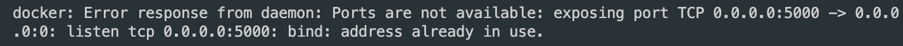
    - pid 확인
        ```bash
        $ sudo lsof -i :5000
        ```
        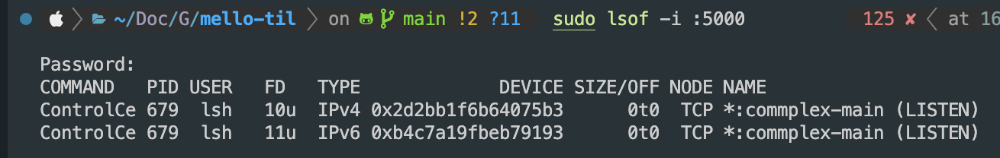
    - ControlCe라는 놈이 쓰고 있음
    - MacOS의 air-play가 차지하고 있다고 함.
    - 지워도 지워도 계속 남아있음;;
    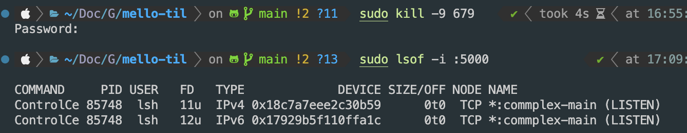
    - AirPlay 계속 쓰고 싶고 귀찮으니 5001번 포트로 포워딩
    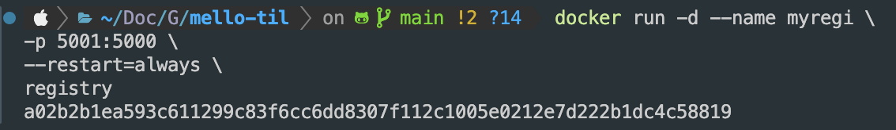
    - 위와 같이 사용하면 외부에서는 5001번으로 접근 가능
    - 컨테이너 내부에서는 여전히 5000번 포트 사용
    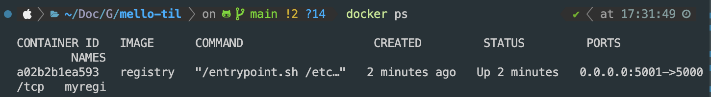
    - 5001번 포트가 컨테이너 내부의 5000번 포트로 포워딩된 것 확인 가능
- 레지스트리 구동 확인
    - myregi가 잘 구동되는지 확인
        ```bash
        $ docker container ls -a
        # == docker ps -a
        ```
    - 5001번 포트 열려있나 확인
        ```bash
        $ netstat -ntlp
        $ netstat -an | grep LISTEN # 맥OS
        ```
        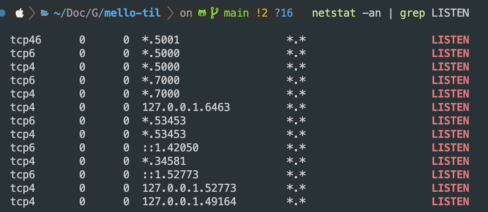
    - Private regi의 ip 찾는 법
        ```bash
        $ docker network inspect bridge
        ```
        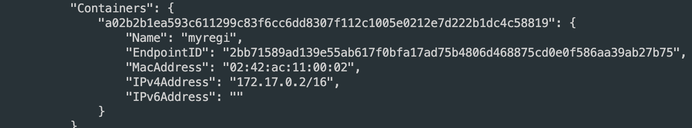
- private regi 접속
    ```bash
    $ curl [private_regi_주소]:5001/v2/
    ```
    - 아직 이미지 없음(올린적 없으니까 ㅋㅋ)
    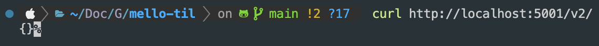

    - 기본적으로 regi 포트는 5000번
    - private regi에 올릴 이미지 태그 생성
        ```bash
        $ docker tag [올릴 이미지명] [private_regi_주소]:5001/[올라갈 이미지명]
        ```
        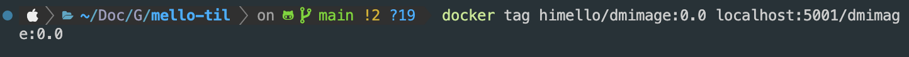
    - 이미지 리스트 확인
        ```zsh
        $ docker images
        ```
        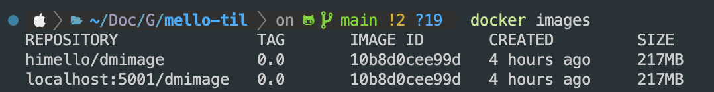
- private regi 이미지 업로드
    - Push 하기
        ```zsh
        $ docker push [private_regi_주소]:5001/[올라갈 이미지명]
        ```
        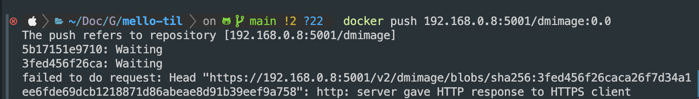
    - 도커 데몬은 https로 레지스트리 접근만 허용함.
    - 따라서 도커 엔진 옵션을 변경해야함
        ```zsh
        $ sudo vi /etc/docker/daemon.json
        ```
        
        ```json
        {
            "insecure-registries" : ["IP주소:5001"]
        }
        ```
        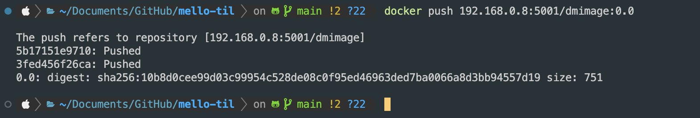

### 오늘의 회고
- 학습 속도가 문제가 있는 듯 하다. 과정 첫 주에 비해 속도도 공부량도 줄었다. 주위 환경을 바꾸어가며 리프레쉬할 계획이다.
- 맥OS에서 5000번 포트를 차지하고 있다. 왜 이렇게 만든건지 모르겠지만, 하나의 이슈를 알 수 있었다.
- 경로도 조금 다르고 daemon.json에 대해서 몰라서 좀 문제가 생긴것같다. 어떻게 된건지 모르겠는데 해결됨;; 아마 삭제하고 다시 해봐야할듯

### 참고 자료 및 링크
- [MacOS 5000번 포트 확보하기](https://algoroot.tistory.com/44)
